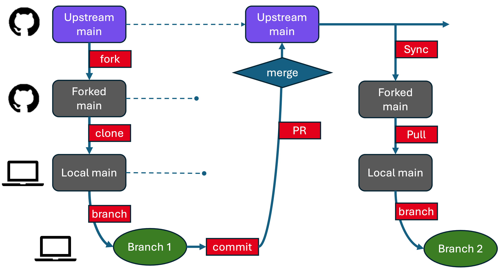

# Collaborating on Someone Else's Repository

> 📝 This guide is part of the `template-project` documentation and is designed for contributors who are working on **a fork of someone else's repository**.

This guide walks you through the typical GitHub workflow to:
- **Fork** a repository
- **Clone** it to your computer
- Create a **branch**
- Make and **commit** changes
- **Push** and open a **pull request**



*A typical GitHub fork and pull request workflow with syncing back to the fork.  You work in a branch; the important copy of the code (and its history) is in the Upstream Main.  The forked main and local main are just a means of transferring information.*

It assumes you're working on GitHub and contributing to a project you don’t own.

See [Github Intro](github_intro.md) for some (brief) additional information about this terminology.

---

## 1. Fork the Repository

Create your *own copy* of a repository on GitHub.

### GitHub.com
- Navigate to the repository you're interested in copying (e.g., `https://github.com/eleanorfrajka/template-project`).
- Click the **Fork** button (top right).
- Select your account as the destination.

This creates `https://github.com/YOUR_USERNAME/template-project` — your personal fork, in your account on Github.com.

---

## 2. Clone the Repository

Download your forked repo to your local machine.

### Terminal
```bash
git clone https://github.com/yourusername/template-project.git
cd template-project
```

### GitHub Desktop
- Open GitHub Desktop.
- File → Clone Repository.
- Choose your fork from the list.

> 💡 Avoid syncing to cloud storage folders — Git and cloud services don’t play well together.

Now you have a "local" copy of the repository on your machine.  At the point when you clone it, it's an exact replica of your forked repository on Github.com.

---

## 3. Add the Original Repo as "Upstream"

This allows you to fetch changes from the original repository later.

### Terminal
```bash
git remote add upstream https://github.com/eleanorfrajka/template-project.git
git remote -v  # Check remotes
```

### VSCode
- Open Terminal in VSCode and run the same commands.

### GitHub Desktop
- Not supported directly, but you can add upstream via command line.

---

## 4. Create a Branch for Your Changes

Best practice: You should never edit your `main` branch directly. Always work in a new branch.  So, start by making a branch.

### Terminal
```bash
git checkout main
git pull upstream main              # Make sure your fork is up to date
git checkout -b yourname-patch-1    # Create and switch to a new branch
```

### VSCode
- Use the bottom-left branch menu to select `main`.
- Pull (if needed).
- Click `+ Create new branch`, and name it.

### GitHub Desktop
- Switch to `main`.
- Fetch origin.
- `Branch > New branch` → name and create.

> 🔁 Syncing upstream ensures you're working from the latest version of the main project.

---

## 5. Make and Commit Your Changes

### Save your files first!
Then commit them:

### Terminal
```bash
git add .
git commit -m "fix: clarify file handling in utils.py"
```

### VSCode
- Open the Source Control panel.
- Write a message.
- Click ✔ Commit.

### GitHub Desktop
- Bottom left: write a commit message.
- Click `Commit to your-branch-name`.

Now your new changes are stored in your local repository: hopefully on a branch of your forked main (if you followed step 4).

---

## 6. Push Your Branch to GitHub

### Terminal
```bash
git push -u origin yourname-patch-1  # First time only (sets upstream)
```

### VSCode
- Click `Publish Branch` in Source Control tab.

### GitHub Desktop
- Click `Push origin` in the top toolbar.

This step pushes your changes to the **upstream main**, the original repository (e.g., if you're contributing to http://github.com/eleanorfrajka/template-project, then this is where they'll end up.

---

## 7. Open a Pull Request

### GitHub.com
- Navigate to your fork.
- You should see a banner to open a pull request.
- Click **Compare & pull request**.
- Add a short title and description.
- Submit the pull request to the original repository.

The project maintainers will review and merge if appropriate.  

Recommended: Maintainers (someone besides you, if it's collaborative) will check that your changes appear sensible and appropriate for the direction the collaborative repository is headed.  They'll review the changes, maybe suggest some edits (which you should then implement and commit a new version), and eventually "approve" the changes.  Once approved, you--as the originator of the changes--should "merge" the pull request (if you have the rights to do this).

Don't worry - if you made the pull request by mistake, or changed your mind, you can close the pull request without merging it into the **upstream main**.

---

## 8. Sync Your Fork (for Next Time)

When the original project (the **upstream main**) updates, you'll want to sync your forked main to the upstream main.  Until you do,  your forked main on Github.com doesn't know about any of these (or anyone else's changes).

### GitHub.com
- On your fork, click **Sync fork** (if available).

### Terminal
```bash
git checkout main
git pull upstream main
git push origin main
```

### VSCode

*After* syncing your fork on Github.com, then
```bash
git checkout main
git pull 
git checkout -b yourname-patch-5
```

I try to remember to do this syncing step after every pull request, including making a new branch, so that the next time I open the project in my VSCode, I don't accidently start making changes on main.

---

## Tips

- Always branch off of `main` (in this workflow, your **local main**, which has pulled changes from your **forked main**, which has been synced to the **upstream main**), not an old feature branch.
- Use clear commit messages (`feat:`, `fix:`, `docs:` are great tags).
- If you see merge conflicts during pull or push, ask for help or check GitHub Docs.

---

## Cheatsheet: Handy Git Commands

```bash
git status                # Check file changes and branch info

git remote -v             # Show remotes

git fetch upstream        # Get new data from original repo
git merge upstream/main   # Merge upstream changes into your main

git branch                # List branches
git branch -d name        # Delete branch (if merged)

git log --oneline         # View recent commit messages
```

---

> ✅ Now you’re ready to contribute to open source and collaborative repositories on GitHub!
